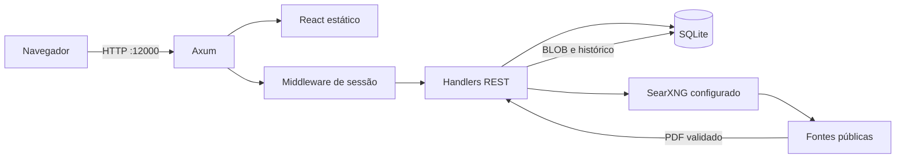

# Arquitetura

## Visão geral

O AgendarX é uma aplicação monolítica leve. Um único processo Axum entrega a API
REST e os arquivos compilados do React. O SQLite permanece em disco local e também
armazena fotos e anexos como BLOBs.

## Componentes

| Componente | Responsabilidade |
|---|---|
| `src/main.rs` | Inicialização, composição das rotas e entrega da SPA |
| `src/config.rs` | Variáveis de ambiente e limites operacionais |
| `src/db/` | Conexão SQLite, migrações automáticas e usuário inicial |
| `src/models/` | Entidades persistidas e contratos JSON |
| `src/handlers/` | Autenticação, pessoas, calendário, configurações, dossiê, vínculos e OSINT |
| `src/middleware/` | Validação do JWT e da sessão revogável |
| `migrations/` | Evolução versionada do banco |
| `frontend/src/` | Rotas, páginas, componentes e serviço HTTP React |
| `deploy/` | Exemplos de implantação, incluindo Portainer |

## Persistência

As migrações são executadas automaticamente na inicialização. O SQLite usa chaves
estrangeiras e exclusões em cascata para os registros dependentes de uma pessoa.
Fotos, anexos pessoais, anexos de vínculos e os ícones personalizados ficam no banco
para simplificar backup e portabilidade.

Tarefas do calendário armazenam os instantes em UTC e pertencem ao usuário que as
criou. A associação com pessoas usa uma tabela de junção, permitindo múltiplos
vínculos sem duplicação e exclusão automática da referência quando a pessoa ou a
tarefa deixa de existir.

Em Docker, todo o estado persistente está sob `/app/data`. O volume precisa ser
mantido entre recriações do contêiner. Como os anexos são BLOBs, o tamanho do banco
cresce junto com o dossiê; monitore o volume e faça backups regulares.

## Autenticação

Senhas são derivadas com Argon2. No login, a aplicação cria um JWT e uma sessão no
SQLite. O cliente recebe um cookie `HttpOnly` com `SameSite=Strict`; clientes de API
também podem usar `Authorization: Bearer`. O logout remove a sessão persistida e
revoga o token antes da expiração. A troca de login ou senha exige a senha atual,
gera um novo hash quando necessário e revoga todas as sessões do usuário. As
variáveis `ADMIN_LOGIN` e `ADMIN_PASSWORD` atuam apenas no banco ainda sem usuários,
evitando recriar a credencial de bootstrap depois que o login for alterado.
O ícone do administrador é servido apenas em rota autenticada e permanece separado
do ícone público usado pela marca e pelo favicon.

## Arquivos e mídia

Uploads respeitam `MAX_UPLOAD_BYTES`. A API detecta o tipo do conteúdo, armazena o
BLOB e disponibiliza streaming inline ou download. O streaming aceita um intervalo
HTTP `Range`, permitindo reprodução de áudio e vídeo e visualização de mídia pelo
navegador. O frontend compartilha o mesmo visualizador entre dossiê e vínculos,
com miniaturas WebP de até 512 px para imagens raster e visualização inline de
imagens, áudio, vídeo, PDF e texto. As miniaturas ficam em tabelas de cache
separadas, são criadas junto com novos uploads e geradas sob demanda para anexos
antigos. Uma falha de decodificação mantém o original disponível. Nomes de anexos
podem ser alterados sem regravar o BLOB ou a miniatura.

## Pesquisa pública

O SearXNG é configurado pelo operador; a Stack do Portainer fornece uma instância
privada por padrão e também permite apontar para um serviço externo. A varredura:

1. lê até 50 parâmetros ativos da pessoa;
2. pesquisa cada valor e limita resultados por configuração;
3. deduplica achados pela URL de origem;
4. tenta baixar resultados identificados como PDF;
5. valida DNS, IP, tamanho e assinatura do arquivo;
6. persiste o histórico e o anexo em uma transação.

Downloads automáticos bloqueiam endereços locais, privados e reservados, fixam a
resolução DNS validada e não seguem redirecionamentos.

A integração solicita explicitamente JSON. Um `403` recebe mensagem operacional
específica porque o SearXNG retorna esse status quando `json` não está habilitado
em `search.formats`. O healthcheck da Stack também verifica a presença desse formato
no arquivo carregado antes de considerar o serviço pronto.

## Grafo de vínculos

`PessoaVinculo` representa arestas direcionadas entre pessoas. O endpoint de grafo
combina pessoas, categorias e vínculos em nós e arestas. O Cytoscape.js executa os
layouts e filtros no navegador; nenhuma posição visual é persistida. O clique em
uma aresta abre um drawer que atualiza a própria relação e gerencia anexos por meio
dos mesmos endpoints REST usados pelo formulário de criação.
