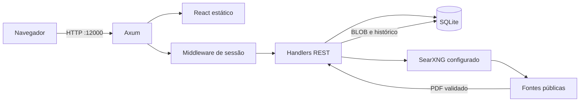

# Arquitetura

## Visão geral

O AgendarX é uma aplicação monolítica leve. Um único processo Axum entrega a API
REST e os arquivos compilados do React. O SQLite permanece em disco local e também
armazena fotos e anexos como BLOBs.

```mermaid
flowchart LR
    U[Navegador] -->|HTTP :12000| A[Axum]
    A --> F[React estático]
    A --> M[Middleware de sessão]
    M --> H[Handlers REST]
    H --> S[(SQLite)]
    H --> X[SearXNG configurado]
    X --> P[Fontes públicas]
    P -->|PDF validado| H
    H -->|BLOB e histórico| S
```

## Componentes

| Componente | Responsabilidade |
|---|---|
| `src/main.rs` | Inicialização, composição das rotas e entrega da SPA |
| `src/config.rs` | Variáveis de ambiente e limites operacionais |
| `src/db/` | Conexão SQLite, migrações automáticas e usuário inicial |
| `src/models/` | Entidades persistidas e contratos JSON |
| `src/handlers/` | Autenticação, pessoas, calendário, configurações, dossiê, vínculos e OSINT |
| `src/middleware/` | Validação do JWT e da sessão revogável |
| `migrations/` | Evolução versionada do banco |
| `frontend/src/` | Rotas, páginas, componentes e serviço HTTP React |
| `deploy/` | Exemplos de implantação, incluindo Portainer |

## Persistência

As migrações são executadas automaticamente na inicialização. O SQLite usa chaves
estrangeiras e exclusões em cascata para os registros dependentes de uma pessoa.
Fotos, anexos pessoais, anexos de vínculos, anexos de tarefas e os ícones
personalizados ficam no banco para simplificar backup e portabilidade.

Tarefas do calendário armazenam os instantes em UTC e pertencem ao usuário que as
criou. A associação com pessoas usa uma tabela de junção, permitindo múltiplos
vínculos sem duplicação e exclusão automática da referência quando a pessoa ou a
tarefa deixa de existir. Arquivos de tarefas e suas miniaturas também são removidos
em cascata com a tarefa. Séries recorrentes são materializadas por até 366 dias e
compartilham um identificador; cada ocorrência permanece editável de forma
independente. Um histórico imutável por ocorrência registra criação, edição,
movimentação, status e operações com anexos.

Em Docker, todo o estado persistente está sob `/app/data`. O volume precisa ser
mantido entre recriações do contêiner. Como os anexos são BLOBs, o tamanho do banco
cresce junto com o dossiê; monitore o volume e faça backups regulares.

Os snapshots usam `VACUUM INTO`, são verificados e recebem SHA-256. A exportação
protegida acrescenta um manifesto de formato, aplicação e schema. Uploads de restore
são gravados em arquivo temporário com limite próprio; depois da prévia e confirmação,
a API de backup do SQLite copia todas as páginas para o banco ativo. Um bloqueio de
manutenção impede requisições concorrentes durante a troca. Migrações, verificação
final, revogação de sessões e recuperação automática da cópia de segurança completam
o processo.

## Autenticação

Senhas são derivadas com Argon2. Login tem limite de corpo, tentativas por conta
e por processo e concorrência de derivação. Contas inexistentes usam hash fictício
com o mesmo custo. Inserção de sessão e atualização de credenciais conferem
atomicamente o hash/login esperado para impedir corridas com troca de senha. No login, a aplicação cria um JWT e uma sessão no
SQLite. O cliente recebe um cookie `HttpOnly` com `SameSite=Strict`; clientes de API
também podem usar `Authorization: Bearer`. O logout remove a sessão persistida e
revoga o token antes da expiração. A troca de login ou senha exige a senha atual,
gera um novo hash quando necessário e revoga todas as sessões do usuário. As
variáveis `ADMIN_LOGIN` e `ADMIN_PASSWORD` atuam apenas no banco ainda sem usuários,
evitando recriar a credencial de bootstrap depois que o login for alterado.
O ícone do administrador é servido apenas em rota autenticada e permanece separado
do ícone público usado pela marca e pelo favicon.

## Arquivos e mídia

Uploads usam leitura incremental com teto por arquivo e limite HTTP sem depender
da cota acumulada do usuário. Uploads respeitam `MAX_UPLOAD_BYTES`; anexos de tarefas também respeitam cotas por
tarefa e por usuário. A API detecta o tipo do conteúdo, armazena o BLOB e
disponibiliza streaming inline ou download. O streaming aceita um intervalo
HTTP `Range`, permitindo reprodução de áudio e vídeo e visualização de mídia pelo
navegador. O frontend compartilha o mesmo visualizador entre dossiê, vínculos e tarefas,
com miniaturas WebP de até 512 px para imagens raster e visualização inline de
imagens, áudio, vídeo, PDF e texto. As miniaturas ficam em tabelas de cache
separadas, são criadas junto com novos uploads e geradas sob demanda para anexos
antigos. Uma falha de decodificação mantém o original disponível. Nomes de anexos
podem ser alterados sem regravar o BLOB ou a miniatura.

O cliente envia anexos de tarefas sequencialmente via `XMLHttpRequest` para exibir
progresso e permitir nova tentativa sem duplicar os arquivos concluídos. Eventos
globais de drag-and-drop de arquivos têm a navegação padrão cancelada; as áreas de
upload extraem `DataTransferItem`, resolvem entradas reais de arquivo e ignoram
diretórios antes do fallback para `DataTransfer.files`. O fallback também é usado
quando o navegador anuncia um item, mas protege `getAsFile()`/`entry.file()`. O
calendário trata
separadamente apenas o arraste interno de tarefas. Isso evita arquivos-fantasma
vazios e que Chromium ou Firefox abram o arquivo em outra aba no Linux.

## Recorrência e lembretes

Recorrências diárias, semanais e mensais são expandidas dentro da transação de
criação. A primeira ocorrência conserva o status informado e as posteriores começam
pendentes. Os lembretes vencidos são filtrados no SQL antes da paginação, consultados pelo
cliente autenticado a cada minuto e dispensados depois da exibição. O reconhecimento
inclui a versão do evento; falhas são repetidas sem duplicar o aviso exibido.
A deduplicação é local à conta e inclui início, configuração e atualização. O aviso interno funciona enquanto a aplicação está
aberta; a notificação do sistema é opcional e exige permissão do navegador nas
configurações. Não há push em segundo plano com a aplicação fechada.

## Pesquisa pública

Cada linha de `parametro_busca` armazena um provider fechado (`SEARXNG`,
`QUERIDO_DIARIO`, `INLABS`, `OPENALEX` ou `DATAJUD`). A migração usa `SEARXNG` como padrão,
portanto bancos anteriores permanecem compatíveis. O módulo
`src/handlers/osint/providers.rs` isola autenticação, transporte, parsing e
normalização de cada fonte em `PublicSearchResult`.

O SearXNG continua configurado pelo operador; a Stack do Portainer fornece uma
instância privada por padrão e também permite apontar para um serviço externo. A
varredura:

1. lê até 50 parâmetros ativos da pessoa;
2. pesquisa cada valor e limita resultados por configuração;
3. deduplica achados pela URL de origem;
4. tenta baixar resultados identificados como PDF;
5. valida DNS, IP, tamanho e assinatura do arquivo;
6. persiste o histórico e o anexo em uma transação.

Querido Diário usa `GET https://api.queridodiario.ok.org.br/gazettes`; OpenAlex usa
`GET https://api.openalex.org/works`; INLABS autentica em
`https://inlabs.in.gov.br/logar.php` e baixa os ZIPs oficiais por data e seção em
`https://inlabs.in.gov.br/index.php`. Falhas são isoladas por pesquisa, registradas
sem consulta ou segredo e convertidas em avisos próprios da fonte.

Downloads automáticos bloqueiam endereços locais, privados e reservados, fixam a
resolução DNS validada e não seguem redirecionamentos.

A integração solicita explicitamente JSON. Um `403` recebe mensagem operacional
específica porque o SearXNG retorna esse status quando `json` não está habilitado
em `search.formats`. O healthcheck da Stack também verifica a presença desse formato
no arquivo carregado antes de considerar o serviço pronto.

## Grafo de vínculos

O domínio `src/domain/hp_psicossocial.rs` calcula HP cumulativo e residual de 2º
grau desde o HP base. A aura representa toxicidade própria, independentemente da
vitalidade recebida. Perfil e grafo usam a mesma função em snapshots SQLite
consistentes. Configuração administrativa e risco são validados em transações
`BEGIN IMMEDIATE`; a migração 17 persiste os parâmetros e os campos do cadastro.
O Cytoscape atualiza os dados em lote e preserva posições, zoom e seleção quando
a topologia permanece igual. Consulte [HP psicossocial](HP_PSICOSSOCIAL.md).

`PessoaVinculo` representa arestas direcionadas entre pessoas. O endpoint de grafo
combina pessoas, categorias e vínculos em nós e arestas. O Cytoscape.js executa os
layouts e filtros no navegador; posições reorganizadas pelo usuário são salvas
por layout. O clique em
uma aresta abre um drawer que atualiza a própria relação e gerencia anexos por meio
dos mesmos endpoints REST usados pelo formulário de criação.

## Índice de busca e atualização da interface

`busca_fonte` reúne documentos de pessoas, tarefas, vínculos e três tipos de
anexos. Triggers mantêm `busca_documento`, com IDs e propriedade de tarefas;
triggers desta tabela sincronizam o FTS5 externo `busca_fts`. `busca_visivel`
remove referências na lixeira e vínculos com pessoas inativas. Cada consulta
aplica a propriedade da tarefa antes de contar e paginar os resultados. O índice
é criado nas migrações, evitando carregar BLOBs em Rust em cada pesquisa.

As telas de pessoas, busca e auditoria recebem resultados paginados. A rota de
pessoas sem paginação continua disponível para seletores e integrações. O painel
calcula totais e listas limitadas no banco, com os limites do dia local enviados
pelo navegador e tratamento separado para datas de dia inteiro.

O cliente HTTP compartilha GETs em andamento sem sinal de cancelamento, usa cache
curto somente quando solicitado e invalida as entradas em mutações e logout.
Um contador de revisão impede respostas antigas de repovoarem o cache após uma
invalidação. A página do grafo carrega pessoas/lixeira sob demanda, deriva sua
lista de vínculos do snapshot e agrupa notificações de atualização.

`useFormDraft` guarda campos serializáveis em localStorage com versão, conta,
formulário e data. A recuperação exige ação do usuário; arquivos permanecem no
fluxo de upload existente. A API de posições mantém a organização por conta e
layout, sem substituir automaticamente a organização inicial do grafo.

## Importação revisável e fila de pesquisas

As migrações 22 e 23 acrescentam prévias de importação e trabalhos de pesquisa.
Prévias pertencem a uma conta e expiram em 30 minutos. A confirmação revalida as
coincidências por email/telefone e aplica todas as decisões em `BEGIN IMMEDIATE`.
Atualizar mantém os dados existentes e acrescenta contatos ausentes.

Um worker OSINT único acompanha trabalhos persistidos, com snapshot dos parâmetros,
checkpoint por parâmetro e token por tentativa. Cancelamento e retomada invalidam
tokens anteriores. As consultas de rede ocorrem fora do bloqueio de manutenção;
cada gravação valida estado, token e geração do banco sob leitura do mesmo bloqueio
usado na restauração. O restore incrementa a geração sob exclusão mútua, interrompe
trabalhos e descarta prévias. Respostas de rede antigas não podem repopular o banco.
A retomada pode repetir o parâmetro parcial; a deduplicação por URL preserva arquivos.

Os modais compartilhados mantêm uma pilha, bloqueiam rolagem enquanto houver um
modal, tornam as camadas inferiores inertes e gerenciam foco inicial, Tab/Shift+Tab,
Escape e retorno ao acionador. O calendário mantém a interface disponível durante
atualização e cancela requisições de meses anteriores, ignorando respostas obsoletas.

A CI e as publicações usam o workflow reutilizável `quality.yml`: formatação,
Clippy, testes Rust, lint, build e regressões de navegador. A publicação manual de
imagens dos pacotes também exige esses testes na tag escolhida.

## Revisões, mesclagem e preferências

A migração 24 acrescenta versões monotônicas a pessoas, vínculos e tarefas,
revisões de edição, marcadores de mesclagem e preferências de lembretes. Triggers
invalidam versões ao alterar campos ou contatos e associações de tarefas. O
cabeçalho `If-Match` é comparado sob `BEGIN IMMEDIATE`, junto à gravação do snapshot
anterior. Restaurar cria uma nova revisão, valida referências e mantém arquivos.
Histórico de tarefa reaproveita a verificação de propriedade do recurso.

A mesclagem revalida duas versões sob uma única transação. Os registros anteriores
ficam no relatório do dossiê e em `mesclagem_registro`; a origem é arquivada e o
destino mantém um limite de revisões restauráveis. Vínculos colapsados viram
arquivos e notas no dossiê. Trabalhos ativos são interrompidos no mesmo commit.

O adiamento usa `lembrete_adiado_ate`, separado da versão de edição. O observador
consulta preferências por conta a cada ciclo, aplica o intervalo no horário local
e inclui o adiamento na chave da notificação e no reconhecimento. Isso evita que
um reconhecimento em voo dispense um aviso recém-adiado.

O painel de saúde exige perfil administrador e reúne dados locais. A verificação
de backup usa a exclusão mútua das operações de backup e valida checksum/integridade
em `spawn_blocking`, sem carregar o arquivo inteiro em memória.
