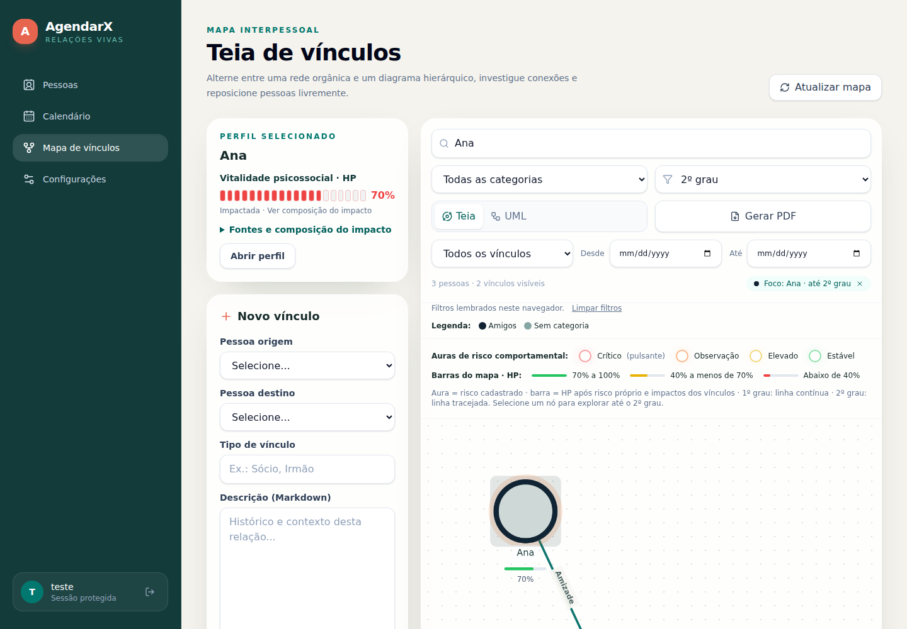
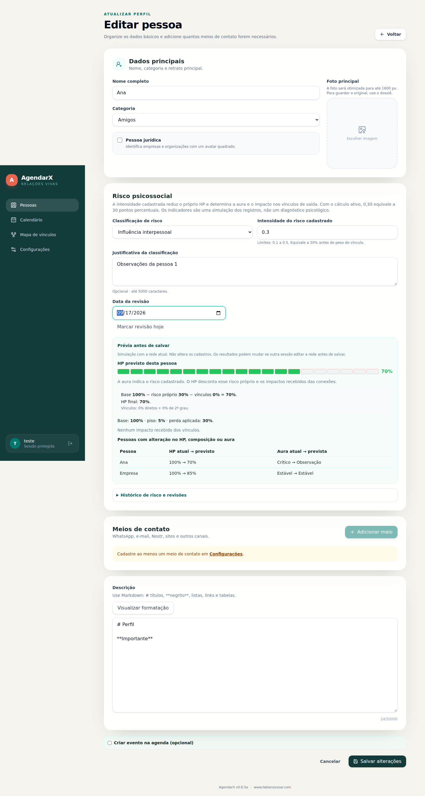

# Interface da v0.6.5a

Capturas reais do frontend compilado com dados simulados da regressão de navegador.
Não representam pessoas reais nem diagnósticos.

## Grafo

## Cadastro e prévia

Regras, API e cálculo: [HP psicossocial](../HP_PSICOSSOCIAL.md).
